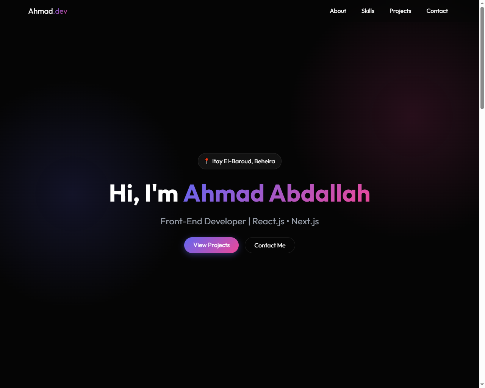

# Ahmad Abdallah | Front-End Developer Portfolio

A modern, responsive portfolio website showcasing my skills, projects, and professional background as a Front-End Developer. The site features a sleek dark-themed design with glassmorphism effects and smooth animations.



## 🚀 Features

- **Modern UI/UX**: Dark theme with glassmorphism design elements (`glass-card`).
- **Responsive Design**: Fully responsive layout using **Bootstrap 5** and custom CSS, ensuring a seamless experience on mobile, tablet, and desktop.
- **Interactive Elements**:
  - **Scroll Reveal**: Sections fade in and slide up as you scroll.
  - **Dynamic Navbar**: Changes appearance on scroll.
  - **3D Tilt Effect**: Hover effects on project and skill cards.
  - **Smooth Scrolling**: Navigation links scroll smoothly to sections.
- **SEO Optimized**: Includes meta tags for better search engine visibility.

## 🛠️ Technologies Used

- **HTML5**: Semantic structure.
- **CSS3**: Custom styling, CSS variables, and animations.
- **Bootstrap 5**: Responsive grid and utility classes.
- **JavaScript (ES6+)**: DOM manipulation, scroll events, and interactive logic.
- **Git/GitHub**: Version control and hosting.

## 📂 Project Structure

```
/
├── assets/          # Images and icons
├── css/
│   └── style.css    # Custom styles and animations
├── js/
│   └── main.js      # PowerPoint logic (Scroll reveal, Tilt effect, etc.)
├── index.html       # Main HTML file
└── README.md        # Project documentation
```

## 📄 Sections

1. **Hero**: Introduction with a call-to-action.
2. **About**: Professional summary.
3. **Skills**: Categorized technical skills (Frontend, Styling, Backend).
4. **Projects**: Showcase of featured projects with links to code and descriptions.
   - *Medical Booking System*
   - *Her Code – Educational Initiative Website*
5. **Education & Certificates**: Academic background and certifications.
6. **Languages**: Language proficiency.
7. **Contact**: Quick links to Email, LinkedIn, GitHub, and Phone.

## 💻 How to Run

1. **Clone the repository**:
   ```bash
   git clone https://github.com/ahmadabdallahh/ahmad-portfolio.git
   ```
2. **Open the project**:
   - Navigate to the project folder.
   - Open `index.html` in your web browser.

## 📬 Contact

- **Name**: Ahmad Abdallah
- **Role**: Front-End Developer
- **Email**: [ahmadabhossen@gmail.com](mailto:ahmadabhossen@gmail.com)
- **LinkedIn**: [Connect on LinkedIn](https://www.linkedin.com/in/ahmad-abdallah-h/)
- **GitHub**: [Follow on GitHub](https://github.com/ahmadabdallahh)

---     
© 2025 Ahmad Abdallah. All Rights Reserved.
